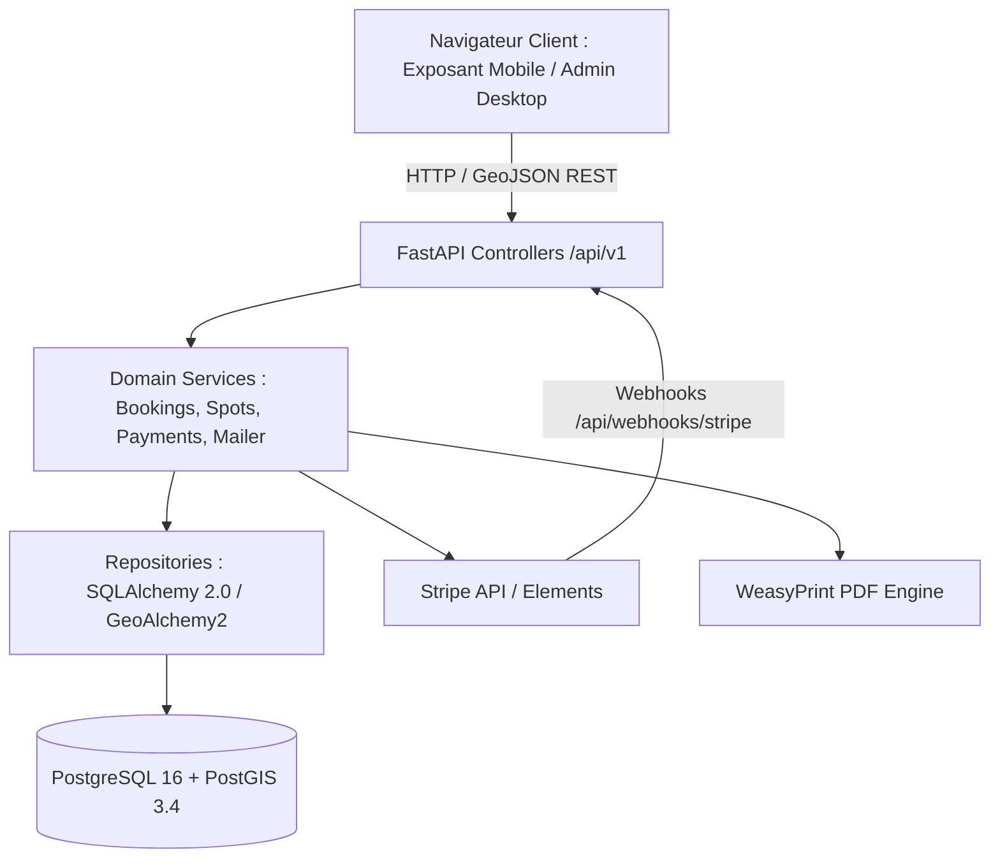
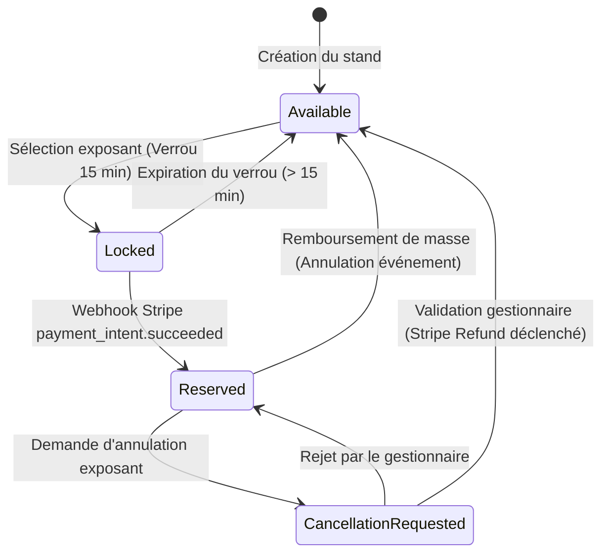
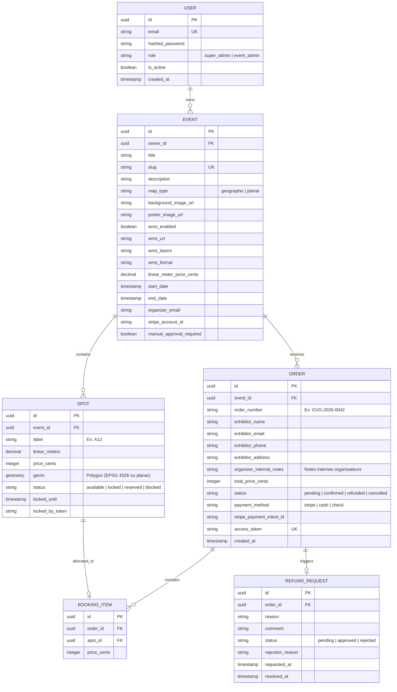

# Architecture Spine — GVG (Gestion de Vide-Greniers)

## Design Paradigm

GVG adopte une architecture en **couches modulaires découplées (Service-Repository)** avec un frontend dédié orienté composant spatial :

1. **Frontend Client (React + Leaflet + Tailwind CSS)** : Responsable de la projection cartographique, de l'interaction tactile (pinch-to-zoom), des outils de tracé vectoriel Geoman et du rendu réactif des états de stands.
2. **API Backend (Python FastAPI + Pydantic v2)** : Contrôleurs REST minces, sérialisation typée, validation des payloads, routage des webhooks Stripe et Swagger OpenAPI interactif.
3. **Couche Métier / Services (Domain Services)** : Encapsule la logique pure : calculs de tarifs, cycle de vie des verrous temporaires, vérification des règles de remboursement, orchestration des emails et génération PDF.
4. **Couche Données / Repository (SQLAlchemy 2.0 + GeoAlchemy2)** : Gestion des entités et requêtes spatiales PostGIS via index GiST, requêtes atomiques de verrouillage sans race-condition.



---

## Invariants & Rules (Architectural Decisions)

### AD-1 [ADOPTED] — Unification Spatiale Géographique et Planaire (PostGIS & Leaflet)
- **Binds:** `FR-2`, `FR-3`, `FR-5`
- **Prevents:** La divergence de code et de stockage entre les vide-greniers de plein air (coordonnées GPS réelles WGS84) et les vide-greniers en intérieur/salle (coordonnées en pixels sur image).
- **Rule:** 
  1. Chaque événement déclare un champ `map_type: 'geographic' | 'planar'`.
  2. En mode `geographic`, PostGIS stocke les stands dans une colonne `geom: geometry(Polygon, 4326)`, et Leaflet utilise la projection Web Mercator standard (`EPSG:3857`) avec tuiles OpenStreetMap/satellite.
  3. En mode `planar`, PostGIS stocke `geom: geometry(Polygon)` (sans SRID ou SRID local 0) basé sur la boîte englobante de l'image `[0, 0, width, height]`, et Leaflet active `L.CRS.Simple`.
  4. L'API backend exporte systématiquement les stands au format standard **GeoJSON (`FeatureCollection`)** via `ST_AsGeoJSON(geom)`, rendant le composant React Leaflet agnostique au type de fond.

### AD-2 [ADOPTED] — Verrouillage Atomique Concurrentiel en Base SQL (Zero Redis)
- **Binds:** `FR-6`, `NFR-1`
- **Prevents:** Les réservations concurrentes d'un même emplacement (surréservation) sans introduire la complexité opérationnelle d'un serveur Redis.
- **Rule:** La pose d'un verrou temporaire (15 minutes) doit être effectuée via une transaction atomique stricte sur PostgreSQL avec la clause :
  ```sql
  UPDATE spots 
  SET status = 'locked', 
      locked_until = NOW() + INTERVAL '15 minutes', 
      locked_by_token = :client_token
  WHERE id = :spot_id 
    AND (status = 'available' OR (status = 'locked' AND locked_until < NOW()))
  RETURNING id;
  ```
  Si `0` ligne est retournée, la requête lève une exception HTTP `409 Conflict`. Le statut d'un stand n'est jamais géré en mémoire vive dans l'application.

### AD-3 [ADOPTED] — Webhook Stripe comme Source Unique de Vérité Financière
- **Binds:** `FR-9`, `NFR-3`
- **Prevents:** La désynchronisation entre le paiement bancaire effectif et la réservation (ex: fermeture du navigateur par Monique avant la redirection finale).
- **Rule:** Le passage d'une réservation de l'état `locked` à l'état `confirmed` est déclenché **exclusivement** par la réception et la vérification cryptographique de la signature du webhook Stripe `payment_intent.succeeded`. La redirection côté frontend sur la page de succès est un état de vue optimiste qui interroge l'état de la commande via polling court si le webhook n'a pas encore été consommé.

### AD-4 [ADOPTED] — Zéro Stockage Serveur de Pièces d'Identité (Allègement RGPD)
- **Binds:** `FR-8`, `FR-17`, `NFR-3`
- **Prevents:** Le stockage de données hautement sensibles (passeports, cartes d'identité), les risques de fuites de données et la surcharge de stockage disque.
- **Rule:** Le backend GVG n'expose aucune route de téléversement (upload) de documents d'identité pour les exposants. L'application génère à la volée un document PDF d'attestation sur l'honneur pré-rempli (moteur `WeasyPrint`), envoyé par email à l'exposant pour vérification physique sur place le Jour J.

### AD-5 [ADOPTED] — Authentification Exposant par Token d'Accès Sécurisé (Magic Token)
- **Binds:** `FR-8`, `FR-13`
- **Prevents:** La création fastidieuse de comptes avec mot de passe pour les particuliers tout en garantissant un accès sécurisé à la commande et aux demandes d'annulation.
- **Rule:** Les exposants réservent en mode invité. L'accès à la commande et la soumission d'une demande de remboursement reposent sur un token HMAC signé (`secrets.token_urlsafe`) généré à la commande : `/e/:slug/orders/:order_id?token=:order_token`. Ce token est transmis dans l'email de confirmation.

### AD-6 [ADOPTED] — Machine à États Finis pour les Remboursements
- **Binds:** `FR-13`
- **Prevents:** Des remboursements automatiques incontrôlés ou la libération de stands sans validation humaine de l'organisateur.
- **Rule:** La demande d'annulation par l'exposant passe la commande en `cancellation_requested`. Le stand reste temporairement bloqué. Seul l'organisateur connecté peut déclencher la transition vers `refunded` (qui appelle l'API Stripe Refund et repasse le stand en `available`) ou `refund_rejected` (qui maintient la place réservée avec saisie d'un motif).



### AD-7 [ADOPTED] — Traitement Asynchrone des Tâches Lourdes (PDF & Emails)
- **Binds:** `FR-14`, `FR-17`, `FR-18`
- **Prevents:** Le blocage du thread HTTP de l'API lors de la compilation de gros fichiers PDF ou de l'envoi de séries d'emails SMTP.
- **Rule:** La génération de PDFs et l'envoi d'e-mails sont délégués aux `BackgroundTasks` de FastAPI. La réponse HTTP est retournée immédiatement au client avec les données JSON nécessaires.

### AD-8 [ADOPTED] — Double Cible de Déploiement : Docker & Script d'Installation Natif Ubuntu
- **Binds:** `NFR-4`
- **Prevents:** L'exclusion des petites associations, communes ou administrateurs disposant d'un simple serveur VPS Ubuntu sans moteur Docker.
- **Rule:** GVG supporte nativement deux modes d'installation officiels de niveau égal :
  1. **Mode Conteneurisé** : `docker-compose.yml` (2 conteneurs : `db` PostGIS + `app` FastAPI/React).
  2. **Mode Natif Ubuntu Linux (Script d'installation automatisé `scripts/install-ubuntu.sh`)** :
     - Installation automatique des paquets APT : PostgreSQL 16 + extension PostGIS, Python 3.12, Nginx, et les bibliothèques C requises par WeasyPrint (`libcairo2`, `libpango-1.0-0`, `libgdk-pixbuf2.0-0`, `shared-mime-info`).
     - Configuration automatique de la base de données et de l'utilisateur dédié `gvg`.
     - Création d'un environnement virtuel Python (`venv`) et installation des dépendances.
     - Configuration du service démon **systemd** (`/etc/systemd/system/gvg.service`) gérant le process Uvicorn avec redémarrage automatique en cas de panne.
     - Configuration d'un bloc **Nginx** servant le build React statique sur `/` et relayant les requêtes API `/api` et `/docs` vers le port local `127.0.0.1:8000`.

### AD-9 [ADOPTED] — Authentification Administrateur JWT & Contrôle d'Accès Basé sur les Rôles (RBAC)
- **Binds:** `FR-19`
- **Prevents:** L'accès non autorisé aux fonctions d'administration et l'interférence entre organisateurs différents.
- **Rule:** 
  1. Table `users` (`id UUID PRIMARY KEY`, `email VARCHAR UNIQUE`, `hashed_password VARCHAR`, `role VARCHAR` ['super_admin', 'event_admin'], `is_active BOOLEAN`, `created_at TIMESTAMPTZ`).
  2. Hachage sécurisé avec `passlib[bcrypt]` ou `bcrypt`.
  3. Tokens JWT signés (`HS256`, clé secrète `JWT_SECRET_KEY`, expiration configurable par défaut à 24h).
  4. Table `events` liée à `users` via une clé étrangère `owner_id UUID REFERENCES users(id)`.
  5. Rétrocompatibilité : migration Alembic avec valeur nullable initialement. Le script CLI `scripts/create_superadmin.py` initialise le premier compte Super-Admin et lui attribue automatiquement tous les événements pré-existants (`UPDATE events SET owner_id = super_admin.id WHERE owner_id IS NULL`).
  6. Dépendances de sécurité FastAPI :
     - `get_current_user` : valide le Bearer token HTTP.
     - `require_super_admin` : vérifie que `user.role == 'super_admin'`.
     - `require_event_owner(event_id)` : garantit que l'utilisateur est le propriétaire de l'événement (`event.owner_id == user.id`) ou possède le rôle `super_admin`. Sinon lève immédiatement une exception HTTP `403 Forbidden`.
  7. Frontend React : Contexte d'authentification (`AuthContext`), persistance du token dans `localStorage`, intercepteur HTTP ajoutant `Authorization: Bearer <token>`, protection des routes `/admin/*` via `<ProtectedRoute />` et redirection automatique vers `/login`.

### AD-10 [ADOPTED] — Moteur de Duplication Géométrique Vierge (Event Cloning Engine)
- **Binds:** `FR-22`
- **Prevents:** La copie involontaire de données transactionnelles (inscriptions, paiements) et l'altération des polygones spatiaux lors de la reconduction d'un événement.
- **Rule:**
  1. La duplication est exécutée dans une transaction SQL atomique unique (`db.begin()`).
  2. Duplication de l'entité `Event` : nom suffixé (ex: "[Nom] - Copie"), nouveau `slug` unique calculé, conservation du `owner_id`, `map_type`, `background_image_url`, paramètres WMS, et `linear_meter_price_cents`. Statut forcé à `draft`, dates `start_date` et `end_date` réinitialisées à `NULL`.
  3. Duplication intégrale des stands (`Spot`) : nouvelles clés primaires UUID, géométrie clonée à l'identique (polygones PostGIS conservés avec intégrité spatiale), allée, numéro de stand, métrage et tarifs de base.
  4. Réinitialisation des statuts de tous les stands dupliqués à `available` (`locked_until = NULL`, `locked_by_token = NULL`).
  5. Zéro copie des tables `orders`, `booking_items`, `refund_requests` et `email_logs`.

### AD-11 [ADOPTED] — Support Cartographique des Flux WMS (IGN Géoplateforme & Saisie Libre)
- **Binds:** `FR-23`
- **Prevents:** La difficulté pour les associations de configurer les couches cartographiques officielles françaises tout en offrant une extensibilité complète pour les SIG communaux.
- **Rule:**
  1. Extension de la table `events` avec les colonnes : `wms_enabled BOOLEAN DEFAULT FALSE`, `wms_url VARCHAR`, `wms_layers VARCHAR`, `wms_format VARCHAR DEFAULT 'image/png'`, `wms_attribution VARCHAR`.
  2. En mode géographique, Leaflet initialise dynamiquement la couche `L.tileLayer.wms(wms_url, { layers, format, transparent: true, version: '1.3.0', crs: L.CRS.EPSG3857, attribution })`.
  3. Catalogue frontend de pré-sélections officielles françaises (sans clé API obligatoire via la Géoplateforme IGN `data.geopf.fr`) :
     - *Orthophoto Aérienne IGN HR* (`https://data.geopf.fr/wms-r/wms`, couche `ORTHOIMAGERY.ORTHOPHOTOS`)
     - *Plan IGN Topographique* (`https://data.geopf.fr/wms-r/wms`, couche `GEOGRAPHICALGRIDSYSTEMS.PLANIGNV2`)
     - *Parcelles Cadastrales* (`https://data.geopf.fr/wms-r/wms`, couche `CADASTRALPARCELS.PARCELLAIRE_EXPRESS`)
     - *OpenStreetMap Standard*
  4. Option de saisie libre d'une URL WMS avec spécification manuelle du nom de couche (`layers`) et validation de l'URL côté client.

### AD-12 [ADOPTED] — Immuabilité Financière des Emplacements Réservés (Price Lock Invariant)
- **Binds:** `FR-24`
- **Prevents:** La modification tarifaire de stands après réservation, source d'écarts de caisse, d'incohérence comptable et de contestations d'exposants.
- **Rule:**
  1. Un stand est réputé "verrouillé financièrement" dès lors qu'il est associé à au moins un enregistrement `booking_items` lié à une commande au statut `pending` ou `confirmed`.
  2. Contrôle backend strict : l'endpoint de mise à jour (`PATCH /api/v1/events/{id}/spots/{spot_id}` ou modification en masse) vérifie cette condition. Si le prix `price_cents` soumis diffère du prix enregistré et que le stand est réservé, l'API rejette immédiatement avec HTTP `400 Bad Request` (`{"detail": "Impossible de modifier le prix d'un stand ayant déjà fait l'objet d'une réservation", "code": "SPOT_PRICE_LOCKED"}`).
  3. Côté frontend : L'inspecteur de propriétés Leaflet désactive le champ de saisie du tarif et affiche un badge informatif : `🔒 Prix verrouillé (réservation active)`.
  4. Si la réservation est ultérieurement annulée et le stand remis en disponibilité, le prix redevient éditable.

### AD-13 [ADOPTED] — Stockage Statique Hautes Performances des Affiches d'Événements (Quota 5 Mo)
- **Binds:** `FR-21`, `FR-26`
- **Prevents:** La saturation disque du serveur, le ralentissement de l'affichage public et la surcharge du serveur applicatif Python.
- **Rule:**
  1. Téléversement via endpoint dédié `POST /api/v1/events/{id}/poster` multipart/form-data.
  2. Contrôles struits : types MIME autorisés `image/jpeg`, `image/png`, `image/webp`. Taille maximale contrôlée à la réception : 5 Mo (5 242 880 octets). Rejet HTTP `413 Payload Too Large` en cas de dépassement.
  3. Stockage sur disque dans `/opt/gvg/backend/uploads/events/{id}/poster.{ext}`.
  4. La colonne `events.poster_image_url` stocke le chemin relatif `/uploads/events/{id}/poster.{ext}`.
  5. Nginx sert directement le répertoire `/uploads/` de manière statique avec en-têtes de cache HTTP (`Cache-Control: public, max-age=86400`) sans solliciter Uvicorn.

### AD-14 [ADOPTED] — Découpage Modulaire par Onglets de la Gestion des Inscriptions
- **Binds:** `FR-25`
- **Prevents:** La surcharge cognitive de l'organisateur et la dégradation de maintenabilité du composant `RegistrationsPage.tsx`.
- **Rule:**
  1. La vue `RegistrationsPage.tsx` est découpée en 4 sous-composants autonomes régis par un query param URL (`?tab=orders|desk|moderation|communications`) :
     - `OrdersTableTab` : liste paginée, recherche, filtres et ouverture de la fiche.
     - `DeskRegistrationTab` : formulaire de saisie au guichet sur place.
     - `ModerationLitigationTab` : arbitrage des annulations et remboursements.
     - `CommunicationsTab` : diffusion d'e-mails groupés et suivi des relances.
  2. Composant `RegistrationDetailDrawer` : fiche exposant avec édition de l'email/téléphone, bloc-notes interne (`organizer_internal_notes`) et bouton de réexpédition d'attestation (`POST /api/v1/events/{id}/orders/{order_id}/resend-confirmation`).

---

## Consistency Conventions

| Domaine | Convention Retenue |
|---|---|
| **Identifiants Primaires** | UUID v7 (triables chronologiquement) pour toutes les entités (`events`, `spots`, `orders`). |
| **Monnaie & Tarifs** | Entiers représentant des centimes d'euros (`price_cents: 800` pour 8,00 €) pour éliminer toute erreur d'arrondi à virgule flottante. |
| **Dates & Heures** | ISO 8601 UTC avec fuseau horaire (`TIMESTAMPTZ` en base, chaînes ISO type `2026-09-04T06:00:00Z`). |
| **Format Géographique API** | GeoJSON RFC 7946 strict (`FeatureCollection` de `Polygon`). Coordonnées `[longitude, latitude]` en mode géo, `[x, y]` en mode planaire. |
| **Structure des Réponses d'Erreur** | RFC 7807 (`Problem Details`) : `{"detail": "Spot A12 is currently locked", "code": "SPOT_LOCKED"}`. |
| **Gestion des Mots de Passe Admin** | Hachage sécurisé Argon2id ou bcrypt via `passlib`. |

---

## Stack Technique (Seed)

| Composant | Technologie & Version | Rôle & Justification |
|---|---|---|
| **Runtime Backend** | Python 3.12 | Langage moderne, lisible, idéal pour monter en compétence. |
| **Framework API** | FastAPI 0.115+ | Haute performance asynchrone, validation Pydantic v2 et Swagger interactif (`/docs`). |
| **Base de Données** | PostgreSQL 16 + PostGIS 3.4 | Moteur relationnel robuste avec requêtes géospatiales natives. |
| **ORM & Couche Données** | SQLAlchemy 2.0 + GeoAlchemy2 | Abstraction SQL typée et intégration native des types spatiaux PostGIS. |
| **Frontend Framework** | React 18 / 19 + Vite 6 | Standard moderne de développement frontend, rapide et léger. |
| **Cartographie Web** | Leaflet 1.9+ | Moteur de rendu cartographique raster/SVG ultra-léger et compatible mobile. |
| **Outils de Dessin** | `@geoman-io/leaflet-geoman-free` | Plugin de référence pour le tracé de rectangles, déplacement, rotation et snapping. |
| **Styles & UI** | Tailwind CSS 3.4+ + Radix UI / shadcn | Composants UI accessibles conformes aux spécifications de Sally (`DESIGN.md`). |
| **Moteur PDF** | WeasyPrint 62+ | Génération de PDFs vectoriels parfaits à partir de templates HTML/CSS simples. |
| **Intégration Paiement** | Stripe Python SDK + Stripe Elements | Gestion sécurisée des encaissements sans transit de données bancaires. |
| **Déploiement Natif** | Bash + Systemd + Nginx | Script `scripts/install-ubuntu.sh` pour déploiement direct sans conteneur sur Ubuntu. |
| **Conteneurisation** | Docker & Docker Compose | Déploiement multi-conteneurs prêt à l'emploi. |

---

## Modèle de Données (Schéma Relationnel & Spatial)



---

## Arborescence du Projet (Scaffold Minimal)

```text
gvg/
├── docker-compose.yml              # Déploiement conteneurisé (PostGIS + FastAPI/React)
├── .env.example                    # Modèle de configuration (DB, Stripe keys, Secret token)
├── scripts/
│   └── install-ubuntu.sh           # Script d'installation automatisé sans Docker (Ubuntu 22.04 / 24.04 LTS)
├── deploy/
│   ├── nginx/
│   │   └── gvg.conf                # Configuration Nginx (Reverse-proxy /api et static frontend)
│   └── systemd/
│       └── gvg.service             # Démon systemd pour Uvicorn / FastAPI
├── backend/
│   ├── Dockerfile
│   ├── pyproject.toml              # Dépendances Python (FastAPI, SQLAlchemy, GeoAlchemy2, WeasyPrint, Stripe)
│   └── app/
│       ├── main.py                 # Point d'entrée FastAPI & configuration CORS
│       ├── core/                   # Configuration (pydantic-settings), sécurité, base de données
│       ├── models/                 # Modèles SQLAlchemy (Event, Spot, Order, RefundRequest)
│       ├── schemas/                # Schémas Pydantic de validation (Request / Response)
│       ├── api/                    # Routes REST (/events, /spots, /orders, /webhooks)
│       ├── services/               # Logique métier (booking_service, stripe_service, pdf_service)
│       └── templates/              # Gabarits HTML Jinja2 pour les PDFs et les emails
└── frontend/
    ├── Dockerfile
    ├── package.json
    ├── vite.config.ts
    └── src/
        ├── components/
        │   ├── map/                # Composant Leaflet, Leaflet-Geoman, couches GeoJSON
        │   ├── ui/                 # Composants boutons, modals, badges (inspirés de shadcn)
        │   └── checkout/           # Formulaire invité & Stripe Elements
        ├── pages/                  # Pages publiques (/e/:slug) et Admin (/admin/...)
        └── lib/                    # Client API fetch et helpers
```

---

## Cartographie Capacités → Architecture

| Exigence PRD | Composant d'Implémentation | Règle / Décision Associée |
|---|---|---|
| **FR-1 & FR-2** (Création & Fond de plan) | `backend/app/api/events.py` + `frontend/src/components/map` | `AD-1` (Mode géographique vs planaire) |
| **FR-3 & FR-4** (Dessin & Numérotation) | `frontend/src/components/map/EditorMap.tsx` (Geoman) | `AD-1` (Géométrie polygone GeoJSON) |
| **FR-5** (Plan interactif public) | `frontend/src/components/map/PublicMap.tsx` | Leaflet SVG + styles Sally (`DESIGN.md`) |
| **FR-6** (Verrou temporaire 15 min) | `backend/app/services/booking_service.py` | `AD-2` (`UPDATE spots ... locked_until`) |
| **FR-8 & FR-9** (Guest Checkout & Stripe) | `frontend/src/components/checkout` + Stripe Elements | `AD-3` (Webhook source de vérité) + `AD-5` |
| **FR-10 & FR-11** (Admin & Réservations hors-ligne) | `backend/app/api/admin.py` | Insertion directe avec `payment_method: check/cash` |
| **FR-13** (Workflow de remboursement) | `backend/app/api/refunds.py` | `AD-6` (State machine d'annulation) |
| **FR-14 & FR-15** (E-mailing & Notifications) | `backend/app/services/mail_service.py` | `AD-7` (FastAPI BackgroundTasks) |
| **FR-17 & FR-18** (Attestation & Émargement PDF) | `backend/app/services/pdf_service.py` (WeasyPrint) | `AD-4` + `AD-7` (Génération HTML to PDF) |
| **FR-19** (Authentification & Rôles Multi-Admins) | `backend/app/api/auth.py` + `frontend/src/context/AuthContext.tsx` | `AD-9` (JWT, bcrypt, RBAC & scope event_id) |
| **FR-20 & FR-21** (Portail public & Vitrine événement) | `frontend/src/pages/HomePage.tsx` + `EventShowcasePage.tsx` | `AD-13` (Nginx static media caching) |
| **FR-22** (Duplication d'événement & plan) | `backend/app/services/cloning_service.py` | `AD-10` (Clonage géométrique vierge PostGIS) |
| **FR-23** (Fonds cartographiques WMS IGN) | `frontend/src/components/map/WmsLayer.tsx` | `AD-11` (Leaflet WMS Géoplateforme + saisie libre) |
| **FR-24** (Verrouillage prix stands réservés) | `backend/app/services/spot_service.py` + `EditorMap.tsx` | `AD-12` (Invariant d'immuabilité financière) |
| **FR-25** (Gestion des inscriptions en onglets & fiche) | `frontend/src/pages/admin/RegistrationsPage.tsx` | `AD-14` (Découpage modulaire & Drawer fiche) |
| **FR-26** (Paramètres généraux & upload affiche) | `backend/app/api/events.py` + `EventSettingsPage.tsx` | `AD-13` (Upload streaming 5 Mo max) |
| **NFR-4** (Déploiement Open-Source) | `scripts/install-ubuntu.sh` & `docker-compose.yml` | `AD-8` (Double cible de déploiement) |

---

## Décisions Différées (Deferred)

1. **Serveur de tuiles cartographiques vectorielles dédié** : Différé. OpenStreetMap standard et tuiles satellites publiques suffisent amplement pour le MVP.
2. **WebSocket en temps réel pour rafraîchissement des verrous** : Différé. Un polling court (toutes les 5 à 10 secondes) lors de la consultation du plan est largement suffisant et 10 fois plus simple à maintenir qu'une infrastructure WebSocket/Redis.
3. **Comptes utilisateurs exposants & Historique multi-événements** : Différé en v2 (le parcours invité par token magique répond à 100% des besoins actuels).
